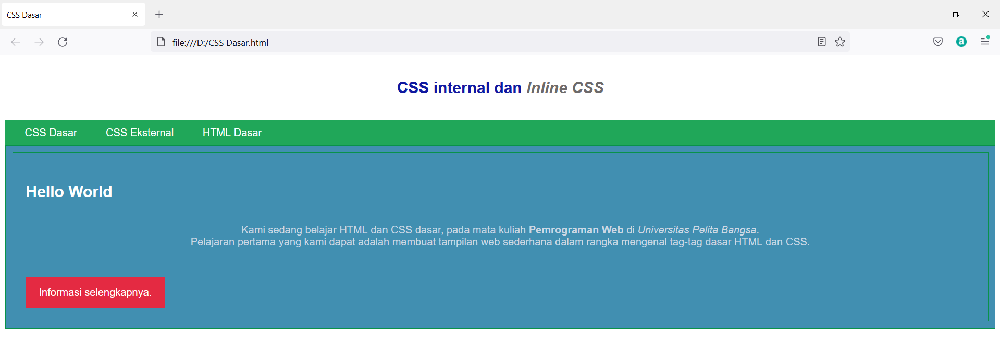

# Lab2Web

Nama  : Bangkit Akbar Anggara 
NIM   : 312010148 
Kelas : TI.20.B.1 

## Tugas 
Berikut adalah tugas praktikum 2 dengan judul Lab2Web dari mata kuliah Pemrograman Web 
 
### HTML 
Berikut adalah HTMLnya atau kalian bisa mengaksesnya dengan mengklik disamping: [Click Here](CSS_Dasar.html) 
 
 
- Keterangan: 
  1.Pertama di bagian atas ini kita buat title atau judul pagenya 
     
  2.Selanjutnya kita buat header body nah jika tadi title untuk page, sementara header body untuk tulisan judul didalam htmlnya 
     
  4.Lalu kita tambahkan link navigasi html lainnya, kalian juga bebas memberikan judul atau nama sesuka hati kalian 
     
  5.Lalu kita buat CSS ID Selector, lalu judul baru dan dibawahnya kita tambahkan paragraf seperti berikut 
     
  6.Terakhir kita buat CSS Class Selector seperti bawah ini 
     

Berikut adalah gambar hasil dari html diatas 
 

### Mendeklarasikan CSS Internal & Menambahkan Inline CSS 
Untuk menambahkan CSS Internal kalian bisa menambahkan codingan seperti gambar dibawah ini 
 
- Keterangan: 
  1.Disini kalian bisa memilih font sesuka hati kalian, saya disini menggunakan Open Sans(sans-serif) 
     
  2.Lalu kalian bisa menentukan panjang dan juga warnanya, kalian bebas menentukannya atau mengikuti saya seperti gambar dibawah 
     
  3.Lalu kalian bisa menambahkan ukuran font, warna, mengatur posisi tex, dan border seperti gambar dibawah 
     
  4.Lalu terakhir kalian tambahkan header warna 
     
  5.Disini kita tambahkan codingan berikut disamping tag p seperti gambar dibawah ini 
     

Berikut adalah tampilan hasil dari mendeklarasikan CSS Internal 
 
### Membuat CSS Eksternal & Menambahkan CSS Selector 
Selanjutnya kita buat file baru yaitu CSS, untuk codingan CSS silahkan kalian ikuti seperti gambar dibawah ini 
 
- Keterangan: 
  1.Disini kalian bisa menambahkan background, warna, dan border 
  2.Kalian bebas megisinya atau mengikuti saya seperti gambar diatas 
  3.Lalu kalian tambahkan tag link untuk menuju file css yang sudah kita buat pada bagian head html tadi 
     
  4.Selanjutnya coba kita buka html tadi jika sudah seperti dibawah ini selamat maka kalian sudah berhasil 
     
  5.Lalu kita tambahkan CSS Selector seperti gambar dibawah ini 
     
  6.Setelah itu kita save dan kita buka kembali htmlnya 
  7.Jika seperti gambar dibawah ini selamat maka kalian sudah berhasil membuat HTML dan CSS dasar 
     

Berikut adalah hasil akhir dari HTML dan CSS 
 

### Pertanyaan & Tugas 
 

### Jawaban 
 

Selamat kalian sudah menyelesaikan tugas praktikum 2 - Lab2Web - Pemrograman Web 
###### By : BANGKIT AKBAR ANGGARA - 312010148 - TI.20.B1 
