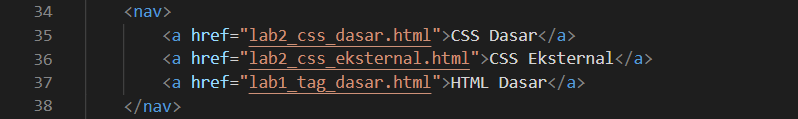

# Lab1Web

Nama  : Bangkit Akbar Anggara 
NIM   : 312010148 
Kelas : TI.20.B.1 

# Tugas

Tugas Pemrograman WEB Lab1Web 
 
Berikut adalah HTML yang saya buat sesuai urutannya 
 
Atau kalin bisa mengaksesnya dengan mengkliknya disamping [Click Here](Home_Page.html) 

Berikut adalah tampilan webnya dari HTML diatas 
 

- Keterangan: 
  - Pertama dibagian atas kita buat link navigasi dimana disitu ada 3 Page yaitu Home Page, Page 2, dan Page Google Website 
    
  - Sehingga tampilannya akan menjadi berikut 
    
  - Setelah membuat link navigasi, maka selanjutnya kita buat title 
    
  - Sehingga ini tampilan setelah kita memberikan title, untuk judul title kalian bebas menamakannya jika kalian mau 
    
  - Lalu setelah kita menambahkan title selanjutnya kita buat paragraf yang berisi judul paragraf dan paragraf baris ke 1 dan ke 2 
    
  - Lalu kita tambahkan sub judul paragraf dan menambahkan gambar UPB atau bebas terserah kalian, tapi usahakan file dan nama gambar sama dengan di html dan berada di satu folder dengan html agar tidak terjadi error 
    
    
  - Berikut adalah tampilan errornya 
    
  - Selanjutnya kita buat html baru Page 2 disini bebas kalian bisa mengisinya dengan apapun sesuka hati kalian 
    
  - Lalu ini adalah tampilan dari Page 2 
    
  - Usahakan Page 2 berada di satu folder yang sama dengan Home Page sehingga ketika kita mengklik Page 2 di link navigasi tidak terjadi error seperti dibawah ini 
    

Oke setelah kalian membuat Home Page dan Page 2, maka selanjutnya kita tes di browser 
 
 
 
Jika hasilnya seperti diatas selamat karena kalian sudah berhasil membuat htmlnya 

- Perubahan: 
  - Disini mari kita coba edit bagian paragraf 
    
  - Jika kita tambah align = "center" dan "right", maka tampilannya akan menjadi berikut 
    
  - Kalian boleh mengeditnya selain menggunakan center dan right yaitu justify dan left sesuka hati kalian 

# Jawab Pertanyaan Berikut 
 

Jawaban: 

